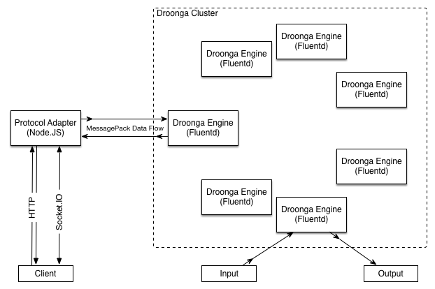
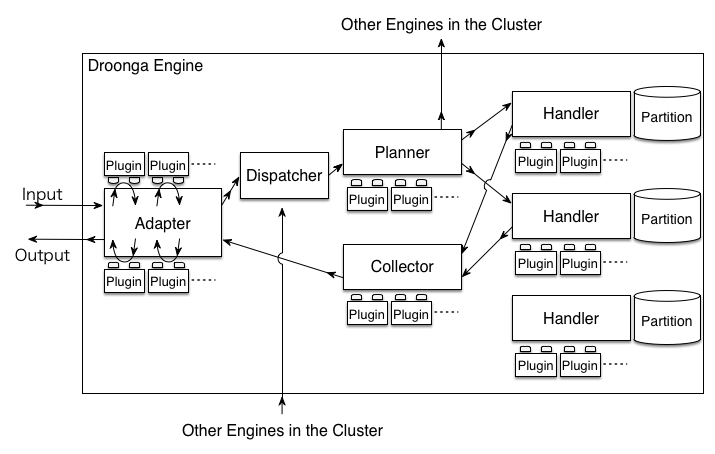


##############################################
  THIS FILE IS AUTOMATICALLY GENERATED FROM
  "_po/ja/overview/index.po"
  DO NOT EDIT THIS FILE MANUALLY!
##############################################


Not yet available in English. See [Japanese version](/ja/overview/) for now.

* TOC
{:toc}

## Droongaとは何か

Droongaは分散型のデータ処理エンジンです。以下の機能を持っています。

### カラム指向データストア

データをカラムの集合として永続的に管理するデータストアとして機能します。

### 全文検索

転置索引方式による本格的な全文検索機能を持っています。またカラムの値によって絞り込みや集計を行うクエリや、緯度経度の位置情報による検索なども可能です。

### レプリケーション＆パーティショニング

Droongaでは複数のサーバが一つのクラスタを構成し、全体として巨大なデータ集合を管理します。
複数のサーバでデータの複製を保存したり、巨大なデータ集合を複数の部分に分割して管理することができます。

### マルチテナンシー

一つのクラスタでは複数の独立なデータ集合を管理することができます。

## 設計方針

Droongaは以下のような方針に基づいて設計されています。

### ストリーム指向

Droonga Engine内では、全ての通信は一方向に流れるデータストリームとなります。検索・更新・集計などの処理の多くは、ストリームを入出力とする機能ブロックがパイプラインを構成することで実現されます。
この構成によって、より高いスループット性能、より低いレイテンシ性能を追究することが可能となっています。

### リアルタイム指向

ここでいう「リアルタイム」とは、ある情報が発生してから、それを必要とするユーザに対して、いかに短い遅延時間で届けることができるか、という性質を指します。
リアルタイム性能は様々な要素が複合的に絡み合って実現されますが、Droongaではこれに寄与する二つの要素を採り入れています。

* 転置索引の即時更新性能に優れる全文検索ライブラリGroongaを採用しています。
* 前述のストリーム指向の構成を採っています。

### 高可用性

すべてのDroonga Engineプロセスに同等の機能を持たせることによって、障害発生時にプロセス単位での可用性を維持できるようにしています。複数のサーバにレプリケーションを持たせることによってデータの永続性を高めています。レプリケーション間の整合性が一時的に損なわれることは許容するものとし、結果整合性の実現を目指します。

### 拡張性

Rubyスクリプトとして記述するプラグインによって自由に機能を拡張することができます。

## ソフトウェア構成

Droongaは大きく二つのコンポーネントで構成されます。

### Droonga Engine

分散データ処理の要となるコンポーネントです。実際にデータを管理・処理します。
Droonga Engineは、Fluentdのplugin(fluent-plugin-droonga)として実装されています。
Droonga Engineへの入出力インタフェースにはFluentdで使用できるあらゆるpluginがそのまま適用できます。
Droonga Engineのクラスタ内部の通信にはMessagePack data stream(Fluent protocol)が使用されます。

### Protocol Adapter

Protocol Adapterは、WebアプリケーションからDroongaを利用しやすくするために、DroongaにHTTPおよびSocket.IOインタフェースを追加するコンポーネントです。
Protocol Adapterは、Node.js用のWebプラットフォームExpressのplugin(express-droonga)として実装されています。
Protocol Adapterを使用することにより、検索クエリをHTTPリクエストとして送信し、検索結果をそのレスポンスとして受け取るC/S型のサービスが利用できるようになります。また、Socket.IOの特質を生かしたpub/sub型のサービスも利用することができます。

## Droongaクラスタの構成

Droongaクラスタは一つ以上のDroonga Engineプロセスで構成されます。
複数のDroonga Engineプロセスが一つのクラスタを構成する時、
クラスタ上の全ての資源を記述するカタログ情報を共有する必要があります。
カタログで管理するのは以下の資源です。

### 発効日時

そのカタログの情報が有効となることが期待される日時を示します。

### ゾーン

クラスタ内に存在する全てのDroonga Engineプロセスと、それらの近接関係を示します。

### ファーム

一つのDroonga Engineプロセスで管理することのできるパーティションの量を示します。

### データセット

データ集合は、整合性をもって管理することが期待されるテーブルの組です。
一つのDroongaクラスタの中には複数のデータ集合を格納することができます。
それぞれのデータ集合は、クラスタの中で一意な名前を持たなければなりません。
一つのデータ集合は、複数の部分(パーティション)に分割されます。また、それぞれのパーティションの複製(レプリカ)が作られます。いずれもクラスタの中に分散して格納されます。
個々のレコードの値から求められるハッシュ値、およびその更新された日時が、パーティション化のキーとなります。
レコードの値からハッシュ値を計算する関数は、そのレコードが属するテーブル毎に定義します。
ひとつのデータ集合を構成する一連のパーティションをリングと呼びます。

## Droonga Engineの処理

クラスタを構成する個々のDroonga Engineでの処理について説明します。

Droonga Engineは、Fluentdのoutput pluginとして動作します。

任意のinput plugin経由で受信するデータストリームをDroongaに対する入力として扱うことができます。

Droonga Engineが受信したデータは、tag名などに応じて、Adapterと呼ばれるモジュールに渡されます。Adapterは、個々のJSONデータを、Droongaの内部処理モジュールが受理できる形式に変換します。

また、Droonga Engineとの通信を行うための特別な形式を満たすJSONデータを特にEnvelopeと呼んでいます。Envelope形式に適合するJSONデータは、Droonga Engineに対する処理要求やその処理結果などをより直接的に表現しています。

Adapterを経て加工されたJSONデータは、Dispatcherと呼ばれるモジュールに渡されます。Dispatcherは、JSONデータをクラスタ内のどのEngineプロセスに転送し、その結果をさらにまたどのEngineプロセスで処理するかといった計画を立て、その実行計画情報をJSONデータに付け加えます。

Dispatcherの出力は、Distributorというモジュールに引き渡され、クラスタ内のEngineプロセスに配送されます。

JSONデータは、データ集合のパーティションを管理するHandlerというモジュールに届けられ、ここでデータストアに対する処理を加えます。必要に応じて処理結果をデータとして出力したり、他のJSONデータをemitしたりします。

複数のパーティションで実行された結果を集約する場合には、Collectorというモジュールにデータが集められ、ここで集計や並べ替えなどの処理にかけられます。

最終的な処理結果をDroonga Engineの外部に出力する際には、再度Adapterモジュールを通過し、出力を受け取る外部プログラムが処理しやすい形式にデータを整形します。

上記のモジュールのうち、Adapter, Distributor, Handler, Collectorについては、Rubyスクリプトで記述するpluginによって、自由に処理をカスタマイズすることができます。
